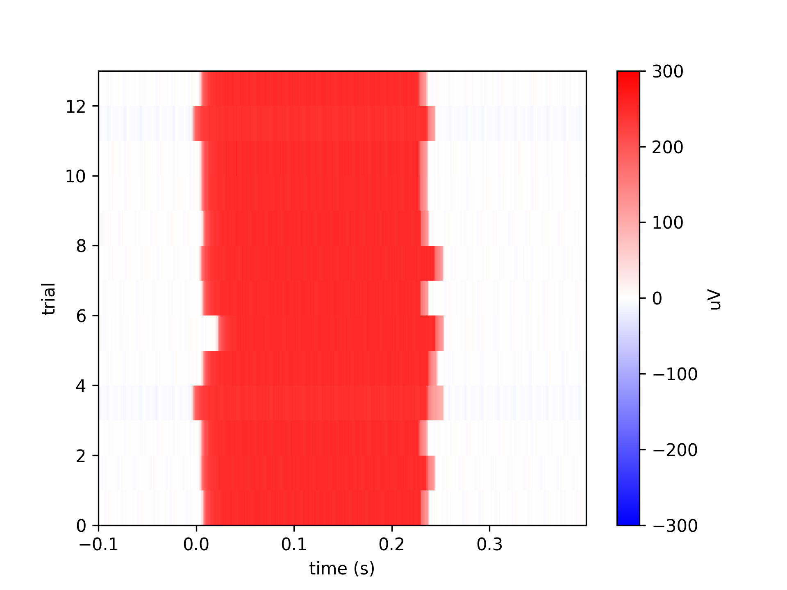

Preproc:
===============
Code for preprocessing neural data (reorganize data into the needed form) including parsing experimental files, trial sorting, and subsampling

.. contents:: :local:

Preprocessed data format
------------------------

Preprocessed BMI3D data takes the form of HDF files containing several datasets. Each dataset is labeled as 
either ``_data`` or ``_metadata`` depending on its source. Datasets with the ``data`` suffix typically contain numpy structured arrays while those denoted ``metadata`` 
contain simple data types. 

On our lab server, preprocessed data is stored in ``/data/preprocessed/``. Use :func:`aopy.data.get_preprocessed_filename` to get the filename of any preprocessed file.
Or use :func:`aopy.data.load_preproc_exp_data`, :func:`aopy.data.load_preproc_eye_data`, :func:`aopy.data.load_preproc_broadband_data`, :func:`aopy.data.load_preproc_lfp_data` to
load the various preprocessed datasets directly.

.. list-table::
   :widths: 25 75
   :header-rows: 1
   
   * - Dataset
     - Contents
   * - ``exp_data``
     - The experimental data. It contains all the information about timing, position, state, events, etc. 
   * - ``exp_metadata``
     - Metadata explaining the experimental data, e.g. information about the subject, date, and experimental parameters
   * - ``eye_data``
     - The eye data, including position and a mask for the eyes being closed.
   * - ``eye_metadata``
     - Metadata about the eye tracking, including labels for which channel corresponds to which eye, sampling rate, etc.
   * - ``mocap_data``
     - Motion capture data
   * - ``mocap_metadata``
     - Metadata explaining the motion capture data
   * - ``broadband_data``
     - Unfiltered raw neural data
   * - ``lfp_data``
     - Neural data that has been low-pass filtered at 500 Hz and downsampled to 1000 Hz
   * - ``spike_data``
     - TBD

Experimental data
-----------------

**clock**

[shape: (13132,), type: [('time', '<u8'), ('timestamp_bmi3d', '<f8'), ('timestamp_sync', '<f8'), ('timestamp_measure_online', '<f8'), ('timestamp_measure_offline', '<f8')]]

A record of the time at which each cycle in the bmi state machine loop occurred.

.. list-table::
   :widths: 25 75
   :header-rows: 1
   
   * - Field
     - Contents
   * - ``time`` (unsigned int)
     - Integer cycle number
   * - ``timestamp_bmi3d`` (float)
     - Uncorrected timestamps recorded by bmi3d
   * - ``timestamp_sync`` (float)
     - Corrected timestamps sent from bmi3d digital output and recorded by eCube digital input. 
   * - ``timestamp_measure_offline`` (float)
     - Corrected timestamps measured from the screen and digitized offline
   * - ``timestamp_measure_online`` (float)
     - Corrected timestamps measured from the screen and digitized online

The figure below shows what each timestamp information is captured by each variable. 

From the experiment computer a clock is recorded in three ways:

#. Directly into the HDF record -- this clock is inaccurate but nice to have as backup
#. As a digital signal from a NIDAQ DIO card -- for accurate sync of BMI3D cycles
#. By measuring a flickering square on the screen with a photodiode -- for accurate measurement of displayed frame timestamps

The preprocessed ``timestamp_measure_offline`` field should be used for aligning data to things that appear on the screen. However, in some cases
there may not be anything appearing on the screen, such as when aligning to laser onset or movement kinematics. In these cases, the ``timestamp_sync`` will be
more accurate.

"Corrected" timestamps have been run through the function :func:`~aopy.preproc.get_measured_clock_timestamps`, which searches for measured timestamps within a given
radius from a known set of timestamps. For `sync` timestamps, the "known" timestamps are the ones from BMI3D. For `measure` timestamps, the "known" timestamps
are the `sync` timestamps.

**events**

[shape: (223,), type: [('code', 'u1'), ('timestamp', '<f8'), ('event', 'S32'), ('data', '<u4')]]

Information needed to reconstruct the structure of the experiment. This data comes from digital output via the ecube. It is sent as
integer codes and then decoded into event names.

.. list-table::
   :widths: 25 75
   :header-rows: 1
   
   * - Field
     - Contents
   * - ``code`` (unsigned int)
     - Raw event code
   * - ``event`` (string)
     - Name of the event
   * - ``data`` (unsigned int)
     - The corresponding data, e.g. which target or which trial type
   * - ``timestamp`` (float)
     - Time at which the event was received by the neural data system.

**bmi3d_events**

[shape: (223,), type: [('time', '<u8'), ('event', 'S32'), ('data', '<u4'), ('code', 'u1')]]

BMI3D's internal record of events, sometimes useful in case you want different timing on events, as described below.

.. list-table::
   :widths: 25 75
   :header-rows: 1
   
   * - Field
     - Contents
   * - ``time`` (unsigned int)
     - Integer cycle number
   * - ``event`` (string)
     - Name of the event
   * - ``data`` (unsigned int)
     - The corresponding data, e.g. which target or which trial type
   * - ``code`` (unsigned int)
     - Raw event code

Events can be used in one of three ways:

#. Directly use the ``events`` from the neural data system.
#. Apply sync clock timestamps to the ``time`` field of ``bmi3d_events``
#. Apply measured clock timestamps to the ``time`` field of ``bmi3d_events`` 

The above each illustrated with an image of alignment between the events and target onset as measured by a photodiode:

.. code-block:: python

    event_timestamps = data['events']['timestamp']
    flash_times = event_timestamps[np.logical_and(16 <= data['events']['code'], data['events']['code'] < 32)]

.. code-block:: python

    cycles = data['bmi3d_events']['time'][target_on_events]
    flash_times = data['clock']['timestamp_sync'][cycles]

.. image:: _images/parse_bmi3d_flash_sync_clock.png

.. code-block:: python    
        
    cycles = data['bmi3d_events']['time'][target_on_events]
    flash_times = data['clock']['timestamp_measure_offline'][cycles]

These are the most reliable benchmark of timing from BMI3D.

**clean_hand_position**

[type: '<f8', shape: (52627, 3)]

Contains raw hand kinematics of each BMI3D cycle but cleaned to include NaNs where appropriate.
In some versions of BMI3D the hand kinematics contained invalid data when the hand was not well
tracked.  

**hand_interp**

[type: '<f8', shape: (457255, 3)]

Contains sampled hand kinematics (1000Hz, see `hand_interp_samplerate`) interpolated 
from the BMI3D hdf file using timing from the eCube digital input.

This can be used as if it were neural data from the eCube. It starts at t=0 and is sampled on the same
clock as all the other neural data. The length won't match the length of other recorded neural data.

**cursor_interp**

[type: '<f8', shape: (457255, 2)]

Contains sampled cursor kinematics (1000Hz, see `cursor_interp_samplerate`) interpolated 
from the BMI3D hdf file using timing from the eCube digital input.

This can be used as if it were neural data from the eCube. It starts at t=0 and is sampled on the same
clock as all the other neural data. The length won't match the length of other recorded neural data.

**cursor_analog_volts**

[type: '<f8', shape: (448647, 2)]

Contains sampled cursor kinematics (1000Hz, see `cursor_analog_samplerate`) captured from the eCube
analog input connected to BMI3D analog output.

This can be used as if it were neural data from the eCube. It starts at t=0 and is sampled on the same
clock as all the other neural data. The length will roughly match the length of other recorded neural data.

**cursor_analog_cm**

[type: '<f8', shape: (448647, 2)]

Contains sampled cursor kinematics (1000Hz, see `cursor_analog_samplerate`) captured from the eCube
analog input connected to BMI3D analog output, but also scaled to be in units of cm. Can sometimes slightly
be off scale and is better used as a timing consistency check rather than as raw data. See cursor_interp instead.

This can be used as if it were neural data from the eCube. It starts at t=0 and is sampled on the same
clock as all the other neural data. The length will roughly match the length of other recorded neural data.

**task**

[shape: (13132,), type: [('cursor', '<f8', (3,)), ('sync_square', '?', (1,)), ('manual_input', '<f8', (3,)), ('trial', '<u4', (1,)), ('plant_visible', '?', (1,))]]

Information about things that change on every cycle of the finite state machine loop.

.. list-table::
   :widths: 25 75
   :header-rows: 1
   
   * - Field
     - Contents
   * - ``cursor`` (float, (3,))
     - (x, z, y) cursor coordinates (in cm)
   * - ``sync_square`` (bool)
     - State of the sync square
   * - ``manual_input`` (float, (3,))
     - (x, y, z) input before transformation to screen coordinates (only present if this was a manual input task)
   * - ``trial`` (unsigned int)
     - Current trial number as calculated by bmi3d
   * - ``plant_visible`` (bool)
     - Whether or not the cursor was visible

**trials**

[shape: (56,), type: [('trial', '<u4'), ('index', '<u4'), ('target', '<f8', (3,))]]

List of conditions generated on each trial. Can have multiple indices corresponding to a single trial. 
Depending on the task, there can be multiple factors listed in this table, but it will always include trial
number and index.

.. list-table::
   :widths: 25 75
   :header-rows: 1
   
   * - Field
     - Contents
   * - ``trial`` (unsigned int)
     - Trial number
   * - ``index`` (float)
     - Generator index
   * - ``target`` (float, (3,))
     - Position of the target for this trial (if the task had targets)

**state**

[shape: (325,), type: [('msg', 'S256'), ('time', '<u4')]]

State machine log
     
.. list-table::
   :widths: 25 75
   :header-rows: 1
   
   * - Field
     - Contents
   * - ``msg`` (string)
     - Usually the name of a state transition, but also includes annotations
   * - ``time`` (unsigned int)
     - Cycle number on which this message occured

**reward_system**

[shape: (6,), type: [('timestamp', '<f8'), ('state', '?')]]
     
State of the reward system, measured at the solenoid so it includes manual rewards.
          
.. list-table::

    :widths: 25 75
    :header-rows: 1

    * - Field
      - Contents
    * - ``timestamp`` (float)
      - Time the reward state changed
    * - ``state`` (bool)
      - State (on or off) of the reward system

**raw bmi3d data**

There are several other fields with the prefix ``_bmi3d``. These contain raw data saved by bmi3d which has been 
preprocessed into the format described above. They are there for debugging purposes.

**qwalor_sensor**

[shape: (11216169,), type: 'int16']

Analog sensor data from the qwalor laser.

**qwalor_trigger**

[shape: (726,), type: [('timestamp', '<f8'), ('value', '<f8')]]

Digital trigger information from the qwalor laser. These timestamps represent timing of the trigger signal that
turns on and off the laser. The laser, however, may take time to turn on and off, and is measured in ``qwalor_sensor``.
See also :func:`~aopy.preproc.bmi3d.find_laser_stim_times` and :func:`~aopy.preproc.bmi3d.get_laser_trial_times`.

.. list-table::

    :widths: 25 75
    :header-rows: 1

    * - Field
      - Contents
    * - ``timestamp`` (float)
      - Time the laser state changed
    * - ``value`` (bool)
      - State (on or off) of the laser

Experimental metadata
---------------------

The `exp_metadata` dataset can contain:

.. list-table::
   :widths: 25 75
   :header-rows: 1
   
   * - Field
     - Contents
   * - ``background``: (float, (4,))
     - color of the background
   * - ``block_number``: (int)
     - unique ID number for this experiment 
   * - ``bmi3d_parser``: (int)
     - parser version number
   * - ``bmi3d_source``: (string)
     - hdf filename where the raw bmi3d data came from
   * - ``bmi3d_start_time``: (float)
     - timestamp recorded by bmi3d internally when the state machine starts (in ms)
   * - ``bmi3d_preproc_date``
     - date the file was preprocessed
   * - ``bmi3d_preproc_version``
     - version of aopy used to preprocess the data
   * - ``cursor_bounds``: (float, (6,))
     - (x, -x, z, -z, y, -y) coordinates bounding the cursor (in cm)
   * - ``cursor_color``: (string)
     - color of the cursor
   * - ``cursor_interp_samplerate`` (float)
     - sampling rate of the interpolated version of the bmi3d cursor data
   * - ``cursor_radius``: (float)
     - radius of the cursor (in cm)
   * - ``data_files``: (dict)
     - raw data files used in preprocessing
   * - ``date``: (string)
     - when the experiment took place
   * - ``delay_penalty_time``: (float)
     - duration of penalty for delay violations
   * - ``delay_time``: (float)
     - how long the cursor has to remain inside the target after the hold is satisfied but before the go cue
   * - ``event_sync_dch``: (int, (8,))
     - range of digital channels on which events are recorded
   * - ``event_sync_dict``: (dict)
     - dictionary of event names and codes used for this experiment
   * - ``event_sync_max_data``: (int)
     - maximum value of event codes
   * - ``event_sync_nidaq_mask``: (int)
     - mask used to drive the national instruments card
   * - ``features``: (string, (8,))
     - ?
   * - ``fps``: (float)
     - cycle rate that bmi3d was targeting
   * - ``fullscreen``: (bool)
     - whether the fullscreen option was turned on
   * - ``generator``: (string)
     - name of the generator used in the experiment
   * - ``generator_params``: (string)
     - string containing the parameters used to initialize the generator
   * - ``hand_interp_samplerate`` (float)
     - sampling rate of the interpolated version of the bmi3d hand data
   * - ``has_measured_timestamps``: (bool)
     - whether the measured_timestamps_online and measured_timestamps_offline fields are available in clock
   * - ``has_reward_system``: (bool)
     - whether the reward system was recorded
   * - ``headstage_channels``: (int, (2,))
     - range of headstage channels recorded on the ecube
   * - ``headstage_connector``: (int)
     - which headstage connector was recorded
   * - ``hold_penalty_time``: (float)
     - duration of penalty for leaving the target too soon before the hold time has elapsed
   * - ``hold_time``: (float)
     - length of time required to hold inside a target
   * - ``iod``: (float)
     - intraocular distance (for 3d displays)
   * - ``latency_estimate``: (float)
     - preprocessing statistic of estimated screen latency before correction
   * - ``latency_measured``: (float)
     - preprocessing statistic of measured screen latency
   * - ``max_attempts``: (int)
     - number of penalties before moving to the next condition in the sequence
   * - ``n_consecutive_missing_markers``: (int)
     - preprocessing statistic of consecutive missing frame markers
   * - ``n_cycles``: (unsigned int)
     - number of cycles the bmi3d state machine ran
   * - ``n_missing_markers``: (int)
     - preprocessing statistic of missing frame markers from the screen sensor
   * - ``n_trials``: (int)
     - number of trials the bmi3d state machine counted
   * - ``notes``: (string)
     - notes on this task entry from the bmi3d database
   * - ``offset``: (int, (3,))
     - for manual control tasks, the (x, y, z) offset applied to raw inputs (for optitrack, in m)
   * - ``penalty_sound``: (string)
     - sound file played for penalties
   * - ``plant_hide_rate``: (float)
     - rate at which the cursor is hidden?
   * - ``plant_type``: (string)
     - 'cursor' is the only option
   * - ``plant_visible``: (bool)
     - whether or not the endpoint is visible to the subject
   * - ``rand_start`` (tuple)
     - (min, max) inter-trial interval duration. Drawn from a uniform distribution between the two.
   * - ``rand_delay`` (tuple)
     - (min, max) delay duration. Drawn from a uniform distribution between the two.
   * - ``random_rewards``: (bool)
     - whether reward timing is randomized 
   * - ``record_headstage``: (bool)
     - whether ecube headstage data is recorded by bmi3d 
   * - ``report``: (string)
     - the offline report saved to the bmi3d database
   * - ``reward_measure_ach``: (int)
     - analog channel used for measuring the reward system output
   * - ``reward_sound``: (string)
     - sound file played during a reward
   * - ``reward_time``: (float)
     - duration of the rewards
   * - ``rig_name``: (string)
     - name of the rig where the experiment was run
   * - ``rotation``: (string)
     - for manual control tasks, the name of the rotation matrix applied to raw inputs
   * - ``scale``: (float)
     - for manual control tasks, the multiplication factor applied to raw inputs
   * - ``screen_dist``: (float)
     - for 3D tasks, the distance the display is located away from the subjects eyes
   * - ``screen_half_height``: (float)
     - for tasks with a window, the height of the display divided by 2 (in cm)
   * - ``screen_measure_ach``: (int)
     - the analog channel used to measure screen refresh rate
   * - ``screen_measure_dch``: (int)
     - the digital channel used to measure screen refresh rate
   * - ``screen_sync_dch``: (int)
     - the digital channel used to measure bmi3d's sync clock
   * - ``screen_sync_nidaq_pin``: (int)
     - pin used by bmi3d to send clock pulses
   * - ``sequence``: (string)
     - the name of the bmi3d sequence used in this task
   * - ``sequence_params``: (string)
     - the parameters used to generate the sequence
   * - ``session_length``: (float)
     - maximum duration of the session. if 0, then the session can continue until the generator is depleted
   * - ``show_environment``: (int)
     - if true, a bounding box is shown in 3D around the workspace where the cursor is allowed to move
   * - ``source_dir``: (string)
     - directory where the source files for this preprocessed data were stored
   * - ``source_files``: (dict)
     - dictionary of files arranged by system that were used to generate this preprocessed data
   * - ``starting_pos``: (float (3,))
     - for cursor tasks, the position where the cursor starts (overridden if position control is used)
   * - ``subject``: (string)
     - name of the subject
   * - ``sw_version``: (string)
     - git hash of the commit being used to run the experiment
   * - ``sync_color_off``: (float (4,))
     - color of the square used for screen sync in the "off" state
   * - ``sync_color_on``: (float (4,))
     - color of the square used for screen sync in the "on" state
   * - ``sync_corner``: (string)
     - where the square for screen sync is located on the display
   * - ``sync_protocol``: (dict)
     - dictionary of events and event codes
   * - ``sync_protocol_version``: (int)
     - version to keep track of changes to the sync parameters
   * - ``sync_pulse_width``: (float)
     - width of clock and event pulses
   * - ``sync_size``: (float)
     - size of the square used for screen sync (in cm)
   * - ``sw_version``: (str)
     - hash of the git version of BMI3D that was used when running the experiment
   * - ``target_color``: (string)
     - name of the color for targets
   * - ``target_radius``: (float)
     - radius of targets (in cm)
   * - ``task_name``: (string)
     - name of the bmi3d task used to run this experiment
   * - ``timeout_penalty_time``: (float)
     - duration of timeout penalties (in s)
   * - ``timeout_time``: (float)
     - time without entering a target before a timeout penalty is applied (in s)
   * - ``trials_per_reward``: (float)
     - how many successful trials are required before a reward is delivered
   * - ``velocity_control``: (bool)
     - for manual control tasks, whether the cursor is under velocity control (true) or position control (false)
   * - ``wait_time``: (float)
     - time between each trial (if autostart is disabled)
   * - ``window_size``: (int, (2,))
     - width and height of the window (in cm)

Motion capture data
-------------------

**optitrack**

[('position', 'f8', (3,)), ('rotation', 'f8', (4,)), ('timestamp', 'f8', (1,)]

.. list-table::
   :widths: 25 75
   :header-rows: 1
   
   * - Field
     - Contents
   * - ``position`` (float (3,))
     - (x, y, z) position samples in time (in m)
   * - ``rotation`` (float (4,))
     - (x, y, z, w) rotation samples in time (quaternion)
   * - ``timestamp`` (float)
     - time at which each sample was recorded (in ecube reference frame)

Motion capture metadata
-----------------------

.. list-table::
   :widths: 25 75
   :header-rows: 1
   
   * - Field
     - Contents
   * - ``source_dir`` (str)
     - directory where the source files are located
   * - ``source_files`` (dict)
     - dictionary of source files organized by system from which this preprocessed data was generated
   * - ``samplerate`` (float)
     - sampling rate of the motion capture data
   * - <other metadata from motive>
     - see motive documentation          
            

Examples
--------

To access the data you can do one of the following

.. code-block:: python
    
    clock = aopy.data.load_hdf_data(result_dir, result_filename, 'clock', 'exp_data')
    
or
    
.. code-block:: python
    
    data = aopy.data.load_hdf_group(result_dir, result_filename, 'exp_data')
    clock = data['clock']  

To access fields inside the individual structured arrays,

.. code-block:: python
    
    timestamps = clock['timestamp']
    first_timestamp = timestamps[0]

Note that you can also access structured arrays by row first, then by column

.. code-block:: python

    first_clock = clock[0]
    first_timestamp = first_clock['timestamp']

Or at the same time

.. code-block:: python

    first_timestamp = clock['timestamp'][0]

API
---

Preproc wrappers
^^^^^^^^^^^^^^^^

These functions are also available directly from ``aopy.preproc``

.. automodule:: aopy.preproc.wrappers
    :members:

Preproc base
^^^^^^^^^^^^

These functions are also available directly from ``aopy.preproc``

.. automodule:: aopy.preproc.base
    :members:

Quality
^^^^^^^

.. automodule:: aopy.preproc.quality
    :members:

BMI3D
^^^^^

.. automodule:: aopy.preproc.bmi3d
    :members:

Oculomatic
^^^^^^^^^^

.. automodule:: aopy.preproc.oculomatic
    :members:

Optitrack
^^^^^^^^^

.. automodule:: aopy.preproc.optitrack
    :members:

Neuropixel
^^^^^^^^^^

.. automodule:: aopy.preproc.neuropixel
    :members:

