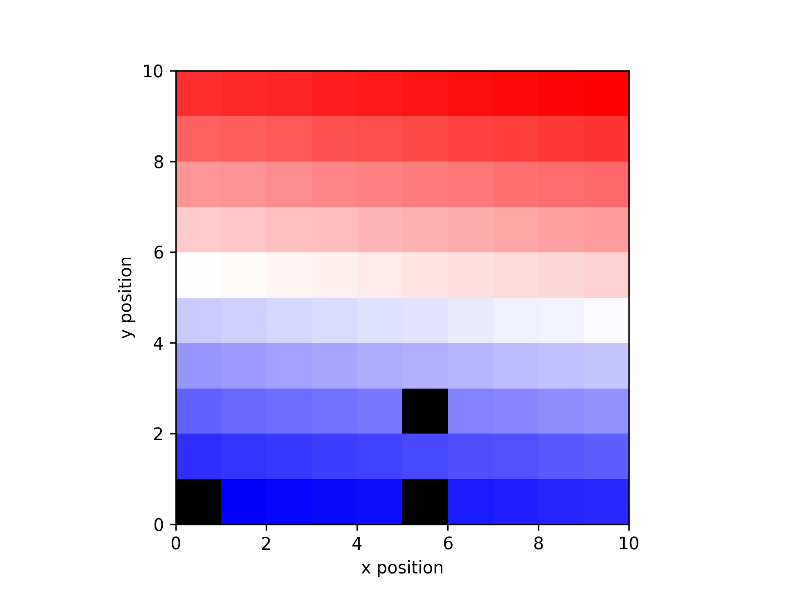

Visualization:
==============

Channel mapping
--------------

To plot electrode data in a spatial layout, you can use the ``get_data_map()`` 
and ``plot_spatial_map()`` functions.

.. code-block:: python

    data = np.linspace(-1, 1, 100)
    x_pos, y_pos = np.meshgrid(np.arange(0.5,10.5),np.arange(0.5, 10.5))
    missing = [0, 5, 25]
    data_missing = np.delete(data, missing)
    x_missing = np.reshape(np.delete(x_pos, missing),-1)
    y_missing = np.reshape(np.delete(y_pos, missing),-1)

    data_map = get_data_map(data_missing, x_missing, y_missing)
    plot_spatial_map(data_map, x_missing, y_missing)

API
---

.. automodule:: aopy.visualization
    :members: